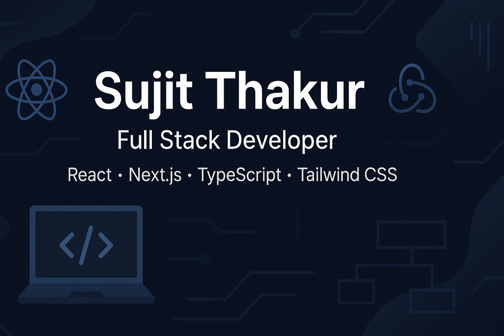

# 👋 Hi, I'm Sujit Thakur

🚀 Full Stack Developer (MERN) | Passionate about building interactive, scalable web apps  

---

## 📫 About Me
- 💻 Working with: **Next.js**, **React**, **Node.js**, **TypeScript**, **Tailwind CSS**, **Redux Toolkit**
- 🌱 Currently learning: Full-Stack Dev, REST APIs, Testing (Cypress, Jest)
- 🔨 Projects: Personalized Dashboard, Portfolio Generator, Online Quiz Maker, Job Board
- 🧪 Tools: GitHub, Vercel, Firebase, MongoDB, VS Code, Postman
- 📫 Email: **tsujeet440@gmail.com**
- 🌐 Portfolio: [https://sujit-porttfolio.vercel.app/](https://sujit-porttfolio.vercel.app/)

---

## 🛠️ Tech Stack

### 🌐 Frontend

### ⚙️ Backend

### 🗄️ Database

### 🔐 Security

### 🛠️ Tools & DevOps

### 💻 Programming Languages

---

## 📌 Pinned Projects
- 🎯 [Quizzy](https://online-quiz-maker-np09.onrender.com/)
- 💼 [Concretion](https://concretion-project.vercel.app/)
- 📊 [Sales Dashboard](https://sales-dashboard-two-xi.vercel.app/)
- 🧠 [Personalized Content Dashboard](https://personalized-dashboard-eight.vercel.app/)
- 🌍 [Wanderlust](https://project-wander.onrender.com/listings)
- 🎬 [Apna Video](https://apnavideofrontend.onrender.com/)

---

## 📈 GitHub Stats

---

## 🤝 Connect with Me

---

## 🎯 Fun Facts
- 💡 I enjoy solving **DSA problems** & building side projects.
- 🌍 Love exploring **new technologies** & contributing to open source.
- 🎵 Music & code = perfect combo for productivity.

---

